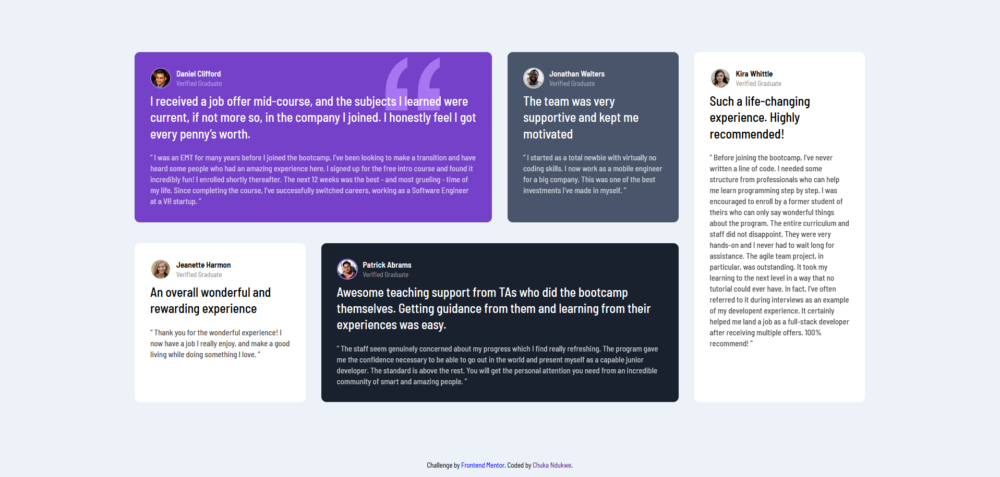

# Frontend Mentor - Testimonials grid section

## Table of Content

- [Overview](#overview)
  - [The challenge](#the-challenge)
  - [Screenshot](#screenshot)
  - [Links](#links)
- [My Process](#my-process)
  - [Built with](#built-with)
  - [Where to find everything](#where-to-find-everything)
  - [Building the project](#building-the-project)
- [Author](#author)

### Hello! 👋

Thanks for checking out my solution to this Front-end Mentor coding challenge.

## Overview

This `README` is written to explain my project and reflect.

[Frontend Mentor](https://www.frontendmentor.io) challenges help me improve my front-end skills by building realistic projects.

### The Challenge

This challenge was to build out a Testimonials grid section and get it looking as close to the design as possible.

Users should be able to:

- View the optimal layout depending on their device's screen size

### Screenshot

### Links

- Solution URL: [(https://github.com/chukadiy/Testimonials-grid-section)]
- Live site URL: [(https://chukadiy.github.io/Testimonials-grid-section/)]

## My Process

I could use any tools I know to help me complete the challenge, but I choose to build with the tools below

### Built with

- Semantic HTML5 markup
- CSS Flex-box & CSS Grid
- Mobile-first workflow

### Where to Find Everything

My goal was to build out the project to the designs inside the `/design` folder. You will find both a mobile and a desktop version of the design. 

The designs are in JPG static format. Using JPGs means that I needed to use my best judgment for styles such as; `font-size`, `padding` and `margin`. However, I was given a style guide in the `style-guide.md` file containing the information I needed such as color palette and fonts.

### Building the project

Below is a process, I used in building this project:

1. I initialized my project as a public repository on [GitHub](https://github.com/). Creating a repo to make it easier to share my code.
2. I configured my repository to publish my code to a web address.
3. I looked through the designs to start planning out how to tackle the project. This step was crucial to help me think ahead for CSS classes to create reusable styles.
4. Before adding any styles, I structured my content with HTML. Writing your HTML first helped me focus my attention on creating well-structured content.
5. I wrote out the base styles for the project, including general content styles, such as `font-family` and `font-size`.
6. I used the Block-Element-Modifier methodology (commonly referred to as BEM) - naming convention for classes in HTML and CSS to help organise my styles.
7. I started adding styles to the top of the page and worked my way down moving on to the next section only when satisfied with the area I was working on.

## Author

- Frontend Mentor - [@chukadiy](https://www.frontendmentor.io/profile/chukadiy)
- Twitter - [@chukadiy](https://www.twitter.com/chukadiy)
